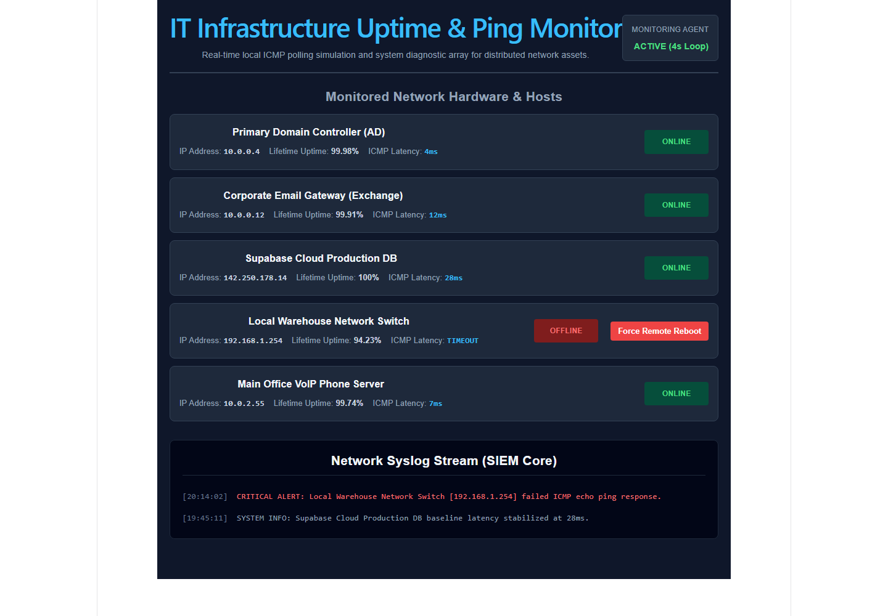

# Infrastructure Ping & Service Alert Engine

A lightweight network polling utility designed to continuously audit server availability, track latency patterns, and route critical offline alerts to administrative webhooks.

<div align="center">
  
</div>

---

## Operational Focus
* **The Problem:** High-cost monitoring suites can be overly complex to configure for simple, rapid status pinging across a small-to-medium enterprise footprint.
* **The Solution:** A highly optimized polling engine that monitors specified target IP addresses, logs response metrics, and dispatches real-time webhook alerts when a server drops offline.

---

## Core Capabilities
* **Multi-Host ICMP/HTTP Polling:** Asynchronous background service that continuously verifies network availability across diverse endpoints.
* **Syslog Metric Generation:** Logs response times, packet loss statistics, and state changes to a centralized structured format for diagnostic auditing.
* **Immediate Webhook Alert Routing:** Instantly parses down states and packages payload data to trigger external alerts (Discord, Slack, or ticketing platforms).
* **Resilient State Auditing:** Prevents false alarms by executing consecutive verification retries before flagging an asset as officially offline.

---

## ⚙️ System Architecture

```
App.jsx (React state layer)
    │
    ├── useState: servers[]  ← 5 infrastructure assets (ONLINE/OFFLINE/REBOOTING)
    ├── useState: logs[]     ← SIEM syslog stream entries
    │
    ├── useEffect: setInterval (4s polling loop)
    │     └── applyPollingLatencyUpdate(servers, random)
    │           └── Only updates ONLINE servers (OFFLINE/REBOOTING are skipped)
    │
    └── handleRebootServer(id, name)
          ├── startRebootTransition() → status: REBOOTING, latency: POLLING...
          ├── Append ADMIN ACTION log entry
          ├── setTimeout(3000ms)
          └── completeRebootTransition() → status: ONLINE, latency: 5ms, uptime: 94.24%
                └── Append RESOLVED log entry

monitorLogic.js (pure functions — fully testable)
    ├── initialServers  (5 assets: 4 ONLINE, 1 OFFLINE)
    ├── initialLogs     (2 pre-seeded syslog entries)
    ├── applyPollingLatencyUpdate(servers, random) ← random is injectable
    ├── startRebootTransition(servers, id)
    ├── completeRebootTransition(servers, id)
    ├── createAdminActionLog(time, name)
    └── createResolvedLog(time, name)
```

---

## 🔬 Test Suite

Tests run against pure logic functions in `monitorLogic.js` using the **Node.js built-in test runner** — zero external test dependencies:

```bash
npm run test
```

| Test | What it verifies |
|---|---|
| `keeps offline server unchanged during polling` | OFFLINE servers are never mutated during automated poll cycles |
| `keeps rebooting servers unchanged during polling` | REBOOTING servers are skipped during polling |
| `updates latency for ONLINE servers when RNG triggers` | Deterministic output verified using injected controlled random values |
| `starts a manual reboot transition for a target server only` | Only target server transitions to REBOOTING; others are untouched |
| `completes a reboot transition with recovered network state` | Server returns to ONLINE with `5ms` latency and `94.24%` uptime |
| `creates operational logs for admin actions and recovery` | Log objects contain correct `time` and `message` fields |

**Key design pattern:** The `random` parameter in `applyPollingLatencyUpdate` is injectable (defaults to `Math.random`), enabling fully deterministic testing without mocking globals.

---

## 🛠️ Local Setup

```bash
npm install
npm run dev
```
Navigate to `http://localhost:5173`.

### Run Tests
```bash
npm run test
```

---

## Recent Architectural Upgrades
* **Operational Restructuring:** Standardized repository file hierarchies by separating core automation logic, helper scripts, and test files.
* **Security Hardening:** Swapped legacy credential configs for environment variables and secure token validation policies.
* **Database Schema Upgrades:** Refactored primitive database types into native data structures for robust ORM and transaction handling.
* **Systems Maintenance:** Eradinated legacy diagnostic scripts, optimized loops, and established static analysis scanning to ensure code hygiene.
